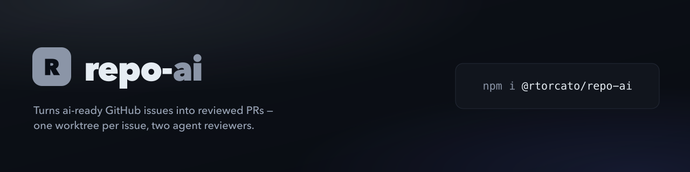

<picture>
  <source media="(max-width: 640px)" srcset="./brand/banner-mobile.png">
  
</picture>

# @rtorcato/repo-ai

The **ai-issue-loop** pipeline: a label-driven loop that takes an `ai-ready` GitHub issue, implements it in its own git worktree, opens a PR, has two agents review it, and hands it to a human to merge.

This package holds the moving parts: the Claude Code skills, the `loop` commands they call, and a `doctor`/`fix` pair for the loop's setup. It was split out of [`@rtorcato/repo-tooling`](https://github.com/rtorcato/repo-tooling) so the tooling can be used without the loop.

See [docs/ai-issue-loop.md](docs/ai-issue-loop.md) for how the pipeline works.

## Install the skills

```bash
npx @rtorcato/repo-ai fix claude-skills
```

This installs `ai-issue-loop`, `ai-workflow`, `ai-issue` and `ai-loop-status` into `~/.claude/skills` (or `--skills-dir <path>`).

**Moving over from repo-tooling?** Skills installed by `@rtorcato/repo-tooling` carry that package's version stamp, so this installer treats them as local edits and won't overwrite them. Run it once with `--force-skills`.

## Commands

| Command | What it does |
|---|---|
| `doctor [--json]` | Audit the loop setup: label spec, `rules.aiLoop.agentUser`, installed skills, `requiredSkills`. Exits 1 only on `drift` / `missing`. |
| `fix labels` | Repair loop label colours and descriptions with `gh label edit`. |
| `fix claude-skills` | Install or update the skills. `--force-skills` overwrites a modified or newer copy. |
| `fix ai-loop-identity` | Point this checkout's Claude sessions at a `gh` profile signed in as `rules.aiLoop.agentUser`. |
| `loop guard` | Repair a wrongly-bare main checkout, gate the `node_modules` rebuild, and assert the agent identity. |
| `loop env` | Resolve a tick's variables (root, worktree root, owner/repo, agent and human users). |
| `loop worktree add <slug>` | Create an `ai-*` worktree off `origin/main` and link its dependencies. |
| `loop cleanup` | Remove `ai-*` worktrees whose PR has landed or closed. |
| `loop reap` | Report agents stalled past 45 minutes and what to do about each. |
| `loop comment <pr>` / `loop verdict <pr>` | Upsert the decision comment, and read a reviewer's verdict marker. |

Every command takes `--json`. Configuration lives in the repo's `.repo-tooling.json` (`rules.aiLoop`, `rules.requiredSkills`).

## License

MIT
